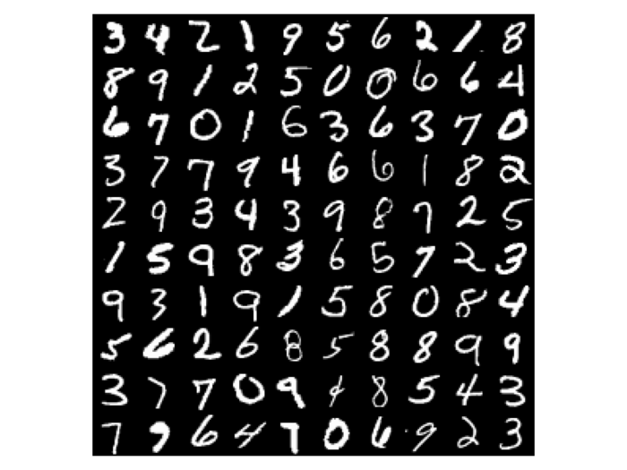

# Digit Recognition for MNIST Data set

## CONFIGURATION 

Python version : 3.11  
library : scikit-datasets numpy matplotlib

The required libraries can be download here :

```
pip install -r requirement.txt  
```

##  Description 
The MNIST data set is a collection of 70.000 black and white handwritten digits from 0 to 9.
The digits have been size-normalized and centered in a fixed-size image.



I took a subset of the data set that I split into a train and test set in the following manner :
training set - 10.000 samples
test set - 1.000 samples

Once the splitting part done, I applied the algorithm K-Nearest Neighbors

1. with fixed k and n in order to test my code.
2. by tuning the value of the hyperparameter k to be the most efficient.
3. by increasing the volume of my training set.


Run the Code here :

```
python DigitRecogition.py
```
